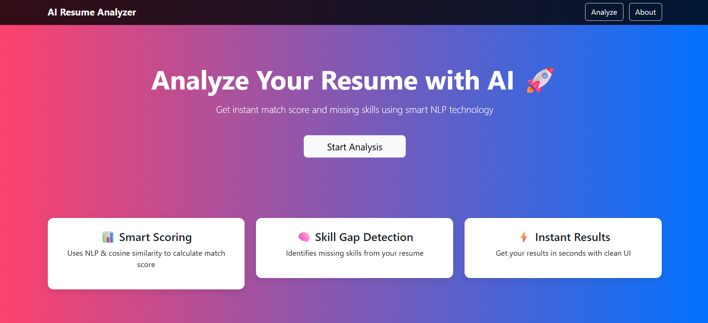
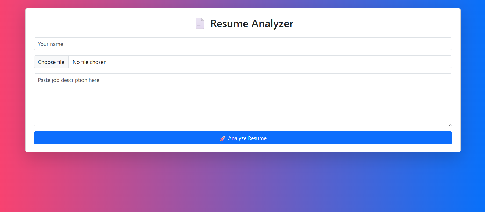
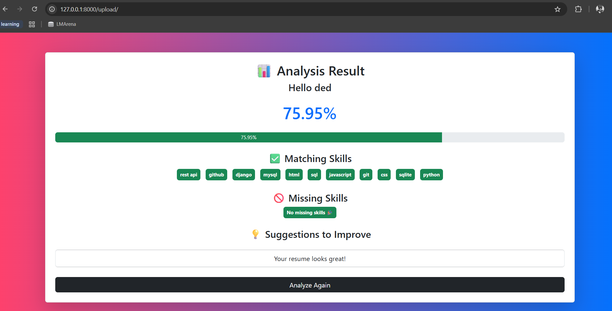
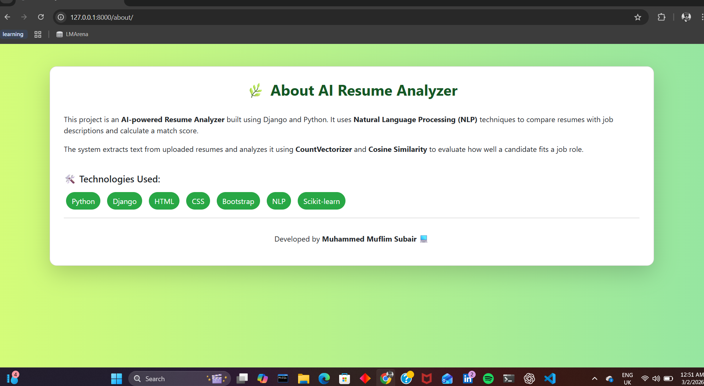

# 🤖 AI Resume Analyzer (Django + NLP + spaCy)

An AI-powered Resume Analyzer web application built using **Django**, **Natural Language Processing (NLP)**, and **spaCy**.

This system evaluates how well a resume matches a job description and provides **match score, skill analysis, and improvement suggestions**.

---

## 🚀 Features

- 📄 Upload Resume (PDF)
- 🧠 Extract resume text using NLP
- 📊 Calculate Resume–Job Match Score
- ✅ Detect Matching Skills
- 🚫 Identify Missing Skills
- 💡 Generate Resume Improvement Suggestions
- 🎨 Professional UI with Bootstrap
- ⏳ Loading Spinner & Smooth Animations

---

## 🧠 How It Works

1. Resume text is extracted using **PyPDF2**
2. Text is cleaned and normalized
3. **TF-IDF vectorization + cosine similarity** calculates match score
4. Skills are detected using **spaCy + keyword matching**
5. Matching and missing skills are identified
6. Suggestions are generated for missing skills

---

## 🛠️ Tech Stack

| Category | Technology |
|---------|------------|
| Backend | Django (Python) |
| NLP | spaCy, TF-IDF, Cosine Similarity |
| Frontend | HTML, CSS, Bootstrap |
| Database | SQLite |
| File Processing | PyPDF2 |

---

## 📸 Screenshots

> Add screenshots inside a folder named `screenshots` in your project

### 🏠 Home Page

### 📄 Upload Page

### 📊 Result Page

### 🌿 About Page

---
